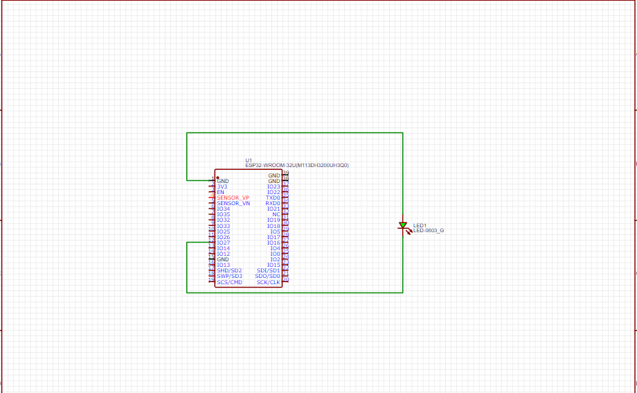

# RWOT-OMIYA-DAUDI-VINCENT-23-U-1652-GCS-PS
> Reviewed and Evaluated by AJr.Allan
# ESP32 LED Brightness Control

This project demonstrates how to use an ESP32 microcontroller to control the brightness of an LED via a web interface. The ESP32 creates a WiFi access point, hosts a web page, and allows users to adjust the LED brightness using a slider.

## Features

- Connects to a specified WiFi network.
- Hosts a web page accessible from any device on the same network.
- Provides a slider to adjust the LED brightness in real-time.

## Components

- ESP32 development board
- LED
- Resistor (appropriate value for LED)
- Breadboard and connecting wires

## Getting Started

### Prerequisites

- Arduino IDE with ESP32 board support installed.
- Basic knowledge of electronics and programming.

### Hardware Setup

1. Connect the LED to GPIO 27 of the ESP32 with a series resistor.
2. Ensure the ESP32 is powered and connected to your computer for programming.

## Schematic Diagram



### Installation

1. Clone this repository:
    ```bash
    git clone https://github.com/your-username/esp32-led-brightness-control.git
    ```
2. Open the project in Arduino IDE.
3. Update the WiFi credentials in the code:
    ```cpp
    const char* ssid = "YOUR_SSID";
    const char* password = "YOUR_PASSWORD";
    ```
4. Upload the code to your ESP32.

### Usage

1. After uploading the code, open the Serial Monitor to check the connection status.
2. Once connected to WiFi, the ESP32's IP address will be displayed in the Serial Monitor.
3. Open a web browser and navigate to the displayed IP address.
4. Use the slider on the web page to adjust the LED brightness.

### Code Explanation

- **WiFi Setup**: Connects the ESP32 to a specified WiFi network.
- **Web Server**: Hosts a web page with a slider for brightness control.
- **LED Control**: Uses PWM to adjust the LED brightness based on slider input.

### Troubleshooting

- **WiFi Connection Issues**: Ensure the SSID and password are correct and that the ESP32 is within range of the WiFi network.
- **Web Page Not Loading**: Check the IP address displayed in the Serial Monitor and ensure your device is on the same network.

## License

This project is licensed under the MIT License - see the [LICENSE](LICENSE) file for details.

## Acknowledgements

- [ESP32 Arduino Core](https://github.com/espressif/arduino-esp32)
- [WebServer Library](https://github.com/espressif/arduino-esp32/tree/master/libraries/WebServer)

---

Feel free to contribute to this project by submitting issues or pull requests!

